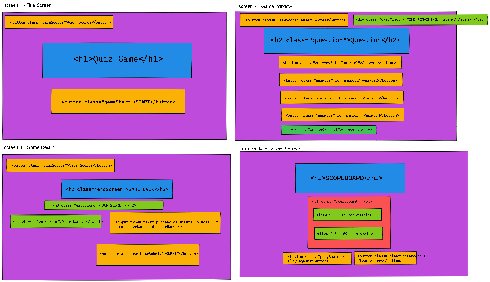
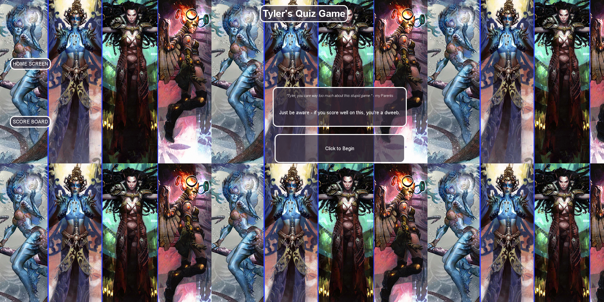
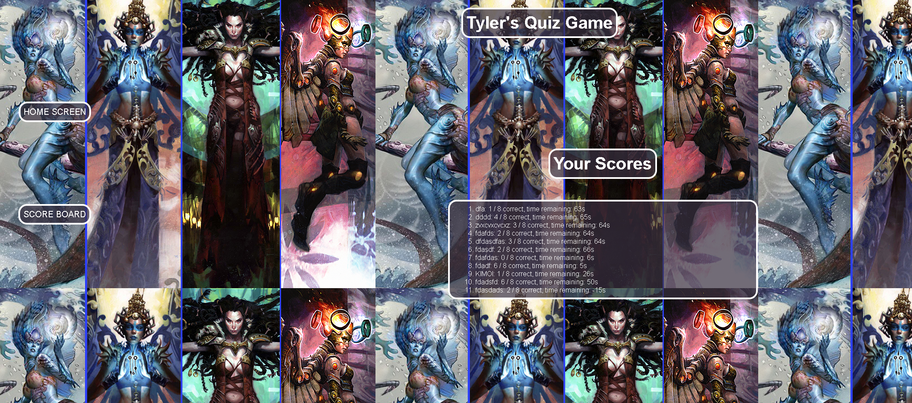

# 04-CodeQuiz


## Our Goal

```
GIVEN I am taking a code quiz
WHEN I click the start button
THEN a timer starts and I am presented with a question
WHEN I answer a question
THEN I am presented with another question
WHEN I answer a question incorrectly
THEN time is subtracted from the clock
WHEN all questions are answered or the timer reaches 0
THEN the game is over
WHEN the game is over
THEN I can save my initials and my score
```


## Mock Up

In wireframing, I planned to have my game menu flip between different screens to display the different menus.



## My Page

I used a variety of different screens for my game.  

This is the home page.  Each button is coded to have a shimmer effect on hover, but I was unable to get a screenshot of it.




When you click the button to start the game, the screen will display a menu with the question and your choices of answers.  The timer will begin counting down upon game start.  Each question answered correctly will raise the point counter by 1, while each incorrect answer will reduce the timer by 5 seconds.

In either situation, clicking on an answer will then move you to the next question.


When the timer ends or you run out of questions, the game will take you to an end screen, where you can enter a name to log your score.


within my nav bar, there are two buttons.  One that will take you back to home screen, and the other that will take you to a scoreboard to see all the scores in local storage.




## My Links

`GitHub Repo`: https://github.com/KIMOISQUIGGLES/04-CodeQuiz
`My webpage`: https://kimoisquiggles.github.io/04-CodeQuiz/